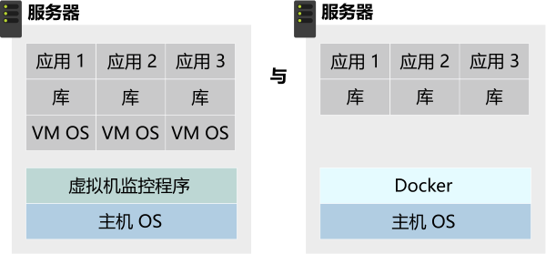
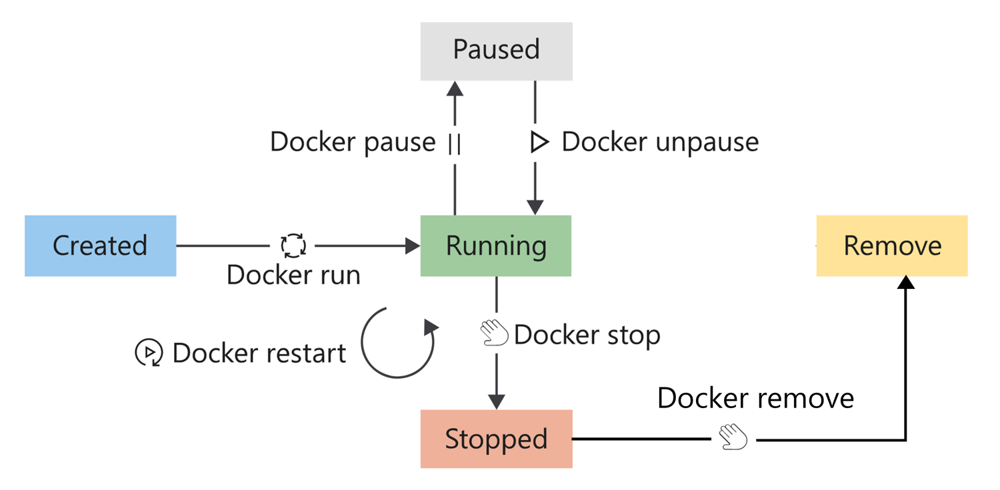

Docker利用Linux的资源隔离机制（容器化），允许用户将**应用本身及运行所需要的全部环境依赖**封装在image镜像中，并可以通过镜像仓库来**分发标准化的部署制品**，所有获取到制品的人通过Docker部署都将能够**获得一致的部署结果**。


> *From: [microsoft-learn](https://learn.microsoft.com/zh-cn/training/modules/intro-to-docker-containers/media/2-docker-architecture.svg)*

<!-- more -->


# 一、Why Docker?

使用Docker可以解决的问题：

- **应用可移植性**：Docker镜像包含了应用程序及所需依赖，可以轻松移植到任何支持Docker的环境
- **托管环境管理**：本地环境、开发环境、生产环境或者云存在各种型号的硬件或软件。通过标准的Docker部署镜像，可以保证一致的部署环境。
- **软件交付连续性**：几乎所有的互联网公司、运营数据中心的公司及部分技术驱动企业都在使用Pipeline，将应用程序的打包、测试和部署与Docker容器结合起来，保证交付的连续性。
- **高效利用基础设施**：通过虚拟化/容器化方案，可以隔离底层的异构架构，统一上层的运行环境。


VM与容器的架构对比：

传统的虚拟化方案（左），需要在主机部署监控程序。同时，每一个VM都有完整的OS支持，需要CPU、磁盘、网络管理、进程调度、内存管理等额外的花销。而使用容器化方案（右），则可以释放这些资源。



> *From: [microsoft-learn](https://learn.microsoft.com/zh-cn/training/modules/intro-to-docker-containers/media/5-multiple-app-isolation.svg)*

# 二、What is Docker？

需要注意的是：在 Linux 上运行的 Docker 容器会共享主机操作系统内核。


## 2.1 Docker应用组件

一个典型的Docker安装包，包含如下组件：

> Docker Server

一个名为dockerd的后台守护进程（Windows Desktop版本进程命名可能存在一些差异），它可以通过API与客户端进行交互。并且可以管理容器的生命周期。

> Docker Client

docker命令工具或者Docker Desktop（GUI）程序。通过命令或Rest API与Docker Server交互，进行容器镜像拉取、镜像构建、容器启停、状态展示等。



> *FROM: [Microsoft-learn](https://learn.microsoft.com/zh-cn/training/modules/intro-to-docker-containers/media/4-docker-container-lifecycle-2.png)*

## 2.2 Docker 镜像（Image）

docker镜像是包含应用及完整运行环境的可移植程序包。通过DockerFile build生成的镜像不可更改（可追加Layer），这个特性可以保证开发环境和生产环境的部署制品（镜像）是一致的。

通常，我们会部署一个镜像仓库来管理和存储应用程序不同版本的镜像。公共的镜像仓库如DockerHub。

有关镜像更多的描述见官网：[Build with Docker | Docker Documentation](https://docs.docker.com/build/guide/)

## 2.3 Dockerfile

Docker 可以通过从 Dockerfile 读取指令来自动构建镜像。

Dockerfile 是一个文本文档，其中包含Build镜像调用的所有命令。每执行一行指令，Docker镜像就会增加一层。


例如一个构建Nginx镜像的Dockerfile：

```dockerfile
# 基础镜像
FROM ubuntu:latest
MAINTAINER nutao
# 安装nginx
RUN apt-get update && apt-get install -y nginx
# 开放80端口
EXPOSE 80
# 启动命令
CMD ["nginx","-g","daemon off;"]
```

在本地build镜像：

```bash
docker build -t nginx:v1 .
```


## 2.4 Docker 容器（Container）

这是一个抽象的概念。将Docker镜像Run在指定的环境，这个Running的应用包，我们称之为容器。比如启动上文的nginx镜像：

```shell
docker run -p 8080:80 --name ng --rm nginx:v1
```

关于镜像和容器在文件系统中存储方式，可以参考下图：


> *From: [microsoft-learn](https://learn.microsoft.com/zh-cn/training/modules/intro-to-docker-containers/media/3-unionfs-diagram.svg)*

