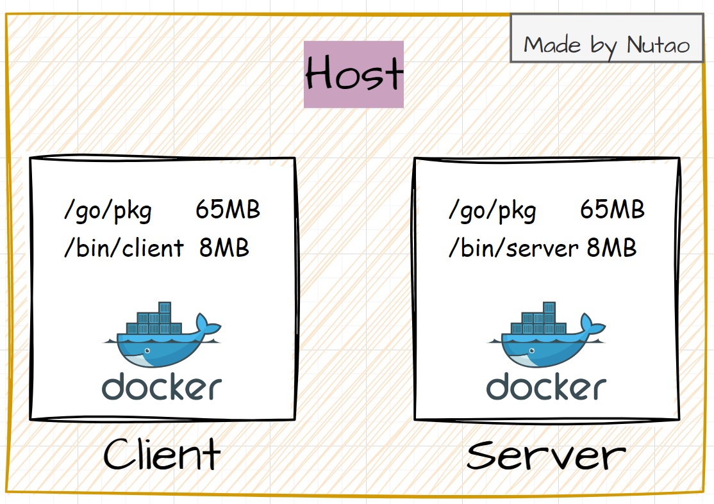
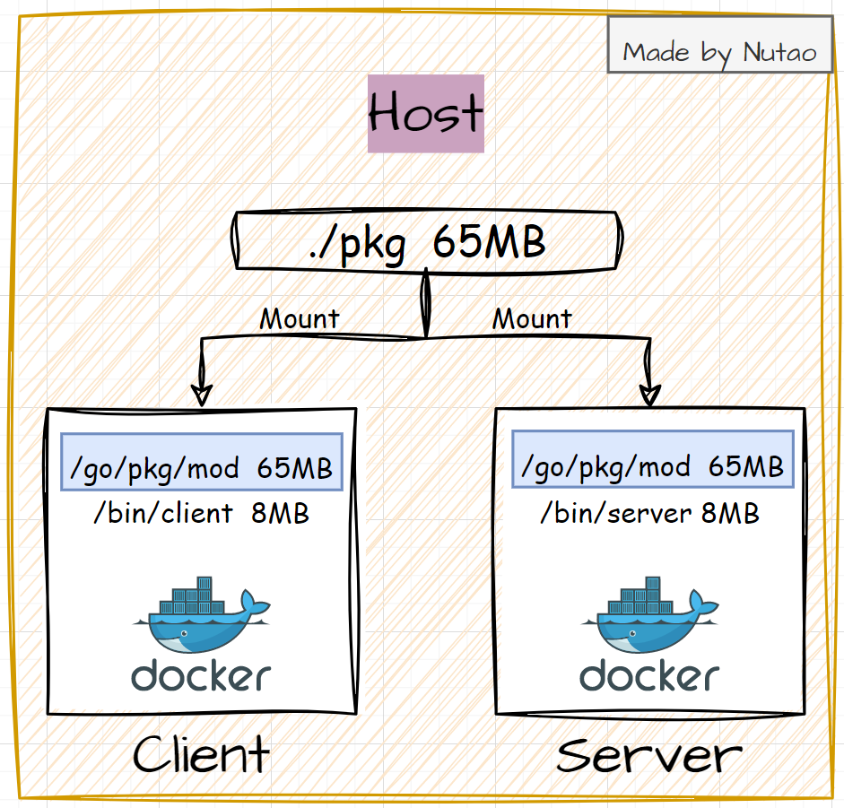

> 本文已投稿至公众号CodeShow，欢迎关注交流容器与云原生技术

接上一篇文章，本文将介绍如何使用挂载缓存（Mount Cache）**加速应用的编译**。经验证，相比直接编译，使用挂载缓存的方案可以节约135%的时间成本。

<!-- more -->

## 一、为什么需要对编译过程加速
使用各种编程语言，都绕不开依赖管理。比如：
- Java/Maven
- Python/pip
- Golang/gomod
- JavaScript/npm
- C++/conan

。。。


通过docker编译应用时，可能会出现某个项目需要拉取**数十个甚至上百个依赖**。即便在公司内搭建有对应的制品仓库，大量的依赖拉取请求，也可能会造成如下问题：
- 制品仓库请求负载较大
- CI耗时较长，阻塞部署效率
- 编译消耗较多的CPU和网络文件句柄，进一步加剧CI编译耗时或者导致部分编译容器崩溃。
- 每个编译都拉取并存依赖，高峰时段，可能宿主机磁盘很快就被占满导致部分CI容器报错等。

## 二、有哪些思路可以解决上述问题
解决依赖缓存的问题，有几个思路可以参考：
1. 通过工具的特性来缓存依赖。如Docker的Mount&Bind宿主机目录，Jenkins的打包插件缓存至宿主机目录等。
2. 通过网络文件系统或者网络块设备共享。如将NFS挂载至Docker目录中，或者把NFS目录挂载在Jenkins的编译机上。
3. 通过卷屏蔽块设备或者文件系统差异。如将使用K8S的管理的Jenkins集群，可以创建PV，并将其挂载至CI容器依赖缓存的目录。使用Docker的Volume关联NFS，然后挂载至CI容器的依赖缓存目录等。

后两种方案其实是在第一种方案上叠buff，方便外挂文件系统的分发或管理。归根结底，还是利用容器中可以外挂文件或目录的特性实现。

## 三、解决方案说明（以Docker为例）
### 3.1 需要了解的背景

使用Docker入门二中的golang-demo工程。需要提前了解的是：

- golang使用gomod管理依赖
- 通常依赖下载路径位于：`${GOPATH}/pkg/mod`
- ${GOPATH} 通常为 `/go`

### 3.2 方案说明（使用Bind&Mount）

众所周知，docker提供 **-v|--volume** 命令，将宿主机目录挂载至容器目录。

```
-v|--volume [=[[HOST-DIR:]CONTAINER-DIR[:OPTIONS]]]
  Create a bind mount. If you specify, -v /HOST-DIR:/CONTAINER-DIR, Docker
  bind mounts /HOST-DIR in the host to /CONTAINER-DIR in the Docker
  container. If 'HOST-DIR' is omitted,  Docker automatically creates the new
  volume on the host.  The OPTIONS are a comma delimited list and can be:

      • [rw|ro]

      • [z|Z]

      • [[r]shared|[r]slave|[r]private]

      • [delegated|cached|consistent]

      • [nocopy]
```

回到需求，我们的目标是**缓存依赖，加速CI编译**。如果将宿主机的某个目录直接挂载至容器内，作为依赖的缓存路径，后续其他CI容器挂载此目录，就能直接使用这个目录的依赖缓存。



### 3.3 改造

为了验证上述方案的实际提示效率。我对工程：https://github.com/Nutao/golang-demo.git 的编译打包程做了优化。比如，将Client和Server的Dockerfile做了拆分。

- Dockerfile.Client

```dockerfile
FROM scratch

COPY ./bin/client /bin/
ENTRYPOINT [ "/bin/client" ]
```

- Dockerfile.Server

```dockerfile
FROM scratch

COPy  ./bin/server /bin/
ENTRYPOINT [ "/bin/server" ]
```

### 3.4 测试脚本准备

，在执行每一条测试验证前，删除docker的镜像layer缓存

```shell
 docker builder prune -af
```

```
ID                                              RECLAIMABLE     SIZE            LAST ACCESSED
syz9faj06goghpxmpjqh4mie8*                      true            76.42MB         18 hours ago
0lps8qdsgia4i7fj5q7r3el62*                      true    503B            5 minutes ago
shj7sncxajdpcogxu1f9xb188*                      true    61.52kB         5 minutes ago
ijq08g8qy0d8hvuj7jmrjy2s1                       true    0B              18 hours ago
f8wwg6uonysx1dh5ytiusuk0n                       true    7.903MB         5 minutes ago
0iviep32sb3mllalm52w3rv34*                      true    0B              5 minutes ago
xhurqymfiw81qbvfoq7908eme                       true    7.972MB         5 minutes ago
1w3cd4cw3wky5hp2p9yx461b2                       true    62.68MB         Less than a second ago
rkwtau92e718nrgie7mno6wvn                       true    34B             Less than a second ago
kwaxq4720nnic2gitsbfmt0xu                       true    61.52kB         Less than a second ago
tzyyosfpjrimqghq20uvm3v83                       true    0B              Less than a second ago
g1kcf6fwjvx3vhxr0vej3cnqg                       true    0B              Less than a second ago
w6v5b5162h4mudtzyrpqeszep                       true    0B              Less than a second ago
wi0piywmrl0gmy0g9go3ivfyb                       true    0B              Less than a second ago
phkwfyw58t2jkyb65pxe31olt                       true    0B              Less than a second ago
Total:  155.1MB
```

- 新增  test_1.sh  脚本用于合并多级构建中两个target镜像的编译流程。

```shell
# /bin/bash
set -ex
docker build --tag=server:v1  --target=server --progress=plain -f Dockerfile.5  .
docker build --tag=client:v1  --target=client --progress=plain -f Dockerfile.5  .
```

- 新增build.sh 脚本用于合并挂载目录方案下的镜像编译流程。

```shell
# /bin/bash
set -ex

docker run --rm --name golang-build   -v .:/src  -v ./pkg:/go/pkg/mod  golang:1.20-alpine sh -c "cd /src && sh build_in.sh"

# 实际的CI可以运行DinD镜像执行build和push流程
docker build -t  client:v2  -f Dockerfile.Client  .
docker build -t  server:v2  -f Dockerfile.Server  .
```

### 3.5 测试结果

- 分target build流程所需时间（real    0m27.654s）

```shell
nutao@Nutao-PC:~/workspace/go_project/buildme$ time sh test.sh 

+ docker build --tag=server:v1 --target=server --progress=plain -f Dockerfile.5 .
#1 [internal] load build definition from Dockerfile.5
#1 transferring dockerfile: 628B done
#2 [internal] load .dockerignore
#2 transferring context: 2B done
#3 resolve image config for docker.io/docker/dockerfile:1
#3 DONE 4.1s
#4 docker-image://docker.io/docker/dockerfile:1@sha256:39b85bbfa7536a5feceb7372a0817649ecb2724562a38360f4d6a7782a409b14
#4 resolve docker.io/docker/dockerfile:1@sha256:39b85bbfa7536a5feceb7372a0817649ecb2724562a38360f4d6a7782a409b14 0.0s done
...
#13 writing image sha256:7718d17674422d9e3dc620bb6cab61e3e9920a5b38694196f32ae6791be78813 done
#13 naming to docker.io/library/server:v1 done
#13 DONE 0.1s
+ docker build --tag=client:v1 --target=client --progress=plain -f Dockerfile.5 .
#1 [internal] load .dockerignore
...
#13 writing image sha256:c04ec920bb0bffd7b65ec20cb252ee6ae639d46696db7167117977816de45207 done
#13 naming to docker.io/library/client:v1 done
#13 DONE 0.1s

real    0m27.654s
user    0m1.202s
sys     0m1.173s
```

- 挂宿主机磁盘编译（real    0m11.812s）

```shell
nutao@Nutao-PC:~/workspace/go_project/buildme$ time ./build.sh

+ docker run --rm --name golang-build -v .:/src -v ./pkg:/go/pkg/mod golang:1.20-alpine sh -c cd /src && sh build_in.sh
+ go env -w 'GOPROXY=https://goproxy.cn,direct'
+ go mod download -x
# get https://goproxy.cn/github.com/charmbracelet/bubbletea/@v/v0.23.1.mod
....
[+] Building 0.2s (5/5) FINISHED                                                                                                                                      
 => [internal] load .dockerignore                                                                     0.0s
....
 => => exporting layers                                                                               0.1s
 => => writing image sha256:bd811041d8204ca1c2752d6ec5f1f3231f2404f69810d783510a7e336ddba664          0.0s
 => => naming to docker.io/library/client:v2                                                          0.0s
+ docker build -t server:v2 -f Dockerfile.Server .
[+] Building 0.1s (5/5) FINISHED                                                                           
 => [internal] load .dockerignore                                                                     0.0s
 => => transferring context: 2B                                                                       0.0s
 => [internal] load build definition from Dockerfile.Server                                           0.0s
 => => transferring dockerfile: 111B                                                                  0.0s
 => [internal] load build context                                                                     0.1s
 => => transferring context: 7.91MB                                                                   0.0s
 => [1/1] COPY  ./bin/server /bin/                                                                    0.0s
 => exporting to image                                                                                0.1s
 => => exporting layers                                                                               0.0s
 => => writing image sha256:800636e0771057709d0e0c488ae54c4e0723b38693c47e65586065852a47a040          0.0s
 => => naming to docker.io/library/server:v2                                                          0.0s

real    0m11.812s
user    0m0.377s
sys     0m0.216s
```


## 四、结论

经过demo验证：

- 分Target分级构建，编译俩golang镜像，耗时约 27.7 s
- 使用docker Bind&Mount提供的特性，编译俩golang镜像，耗时约11.8 s


但是，挂盘缓存后，后续该项目所有的CI流程都可以使用依赖缓存，节约的时间成本会远大于此。

当然，在正式的企业环境内，涉及到磁盘管理的成本可以选择使用NFS、NBD、Ceph等网络磁盘，方便管理和扩容。

> 一起探讨更多的技术细节，试试关注公众号CodeShow


