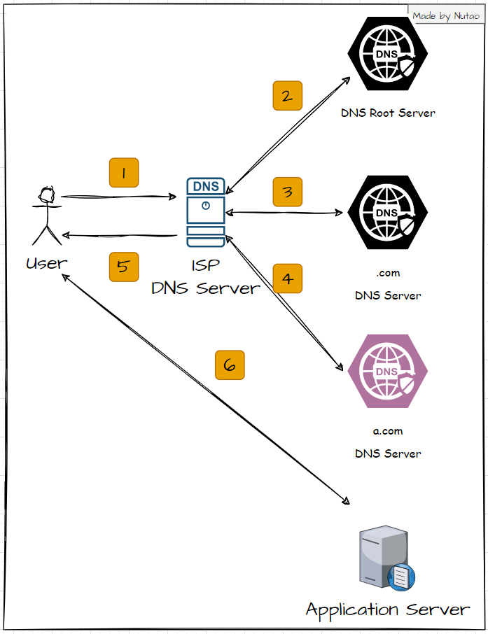
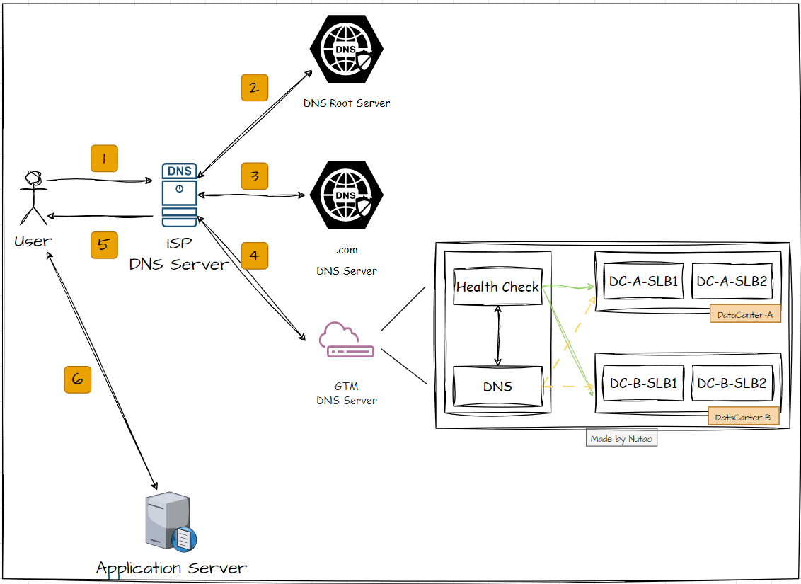
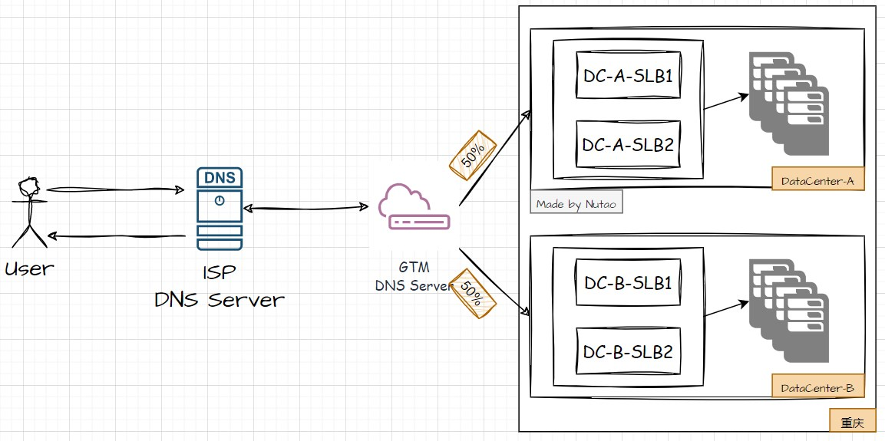
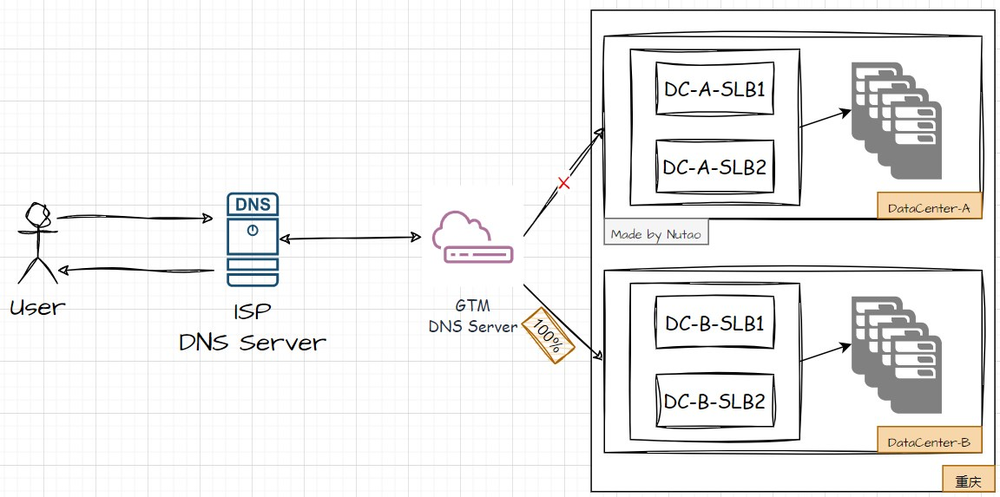
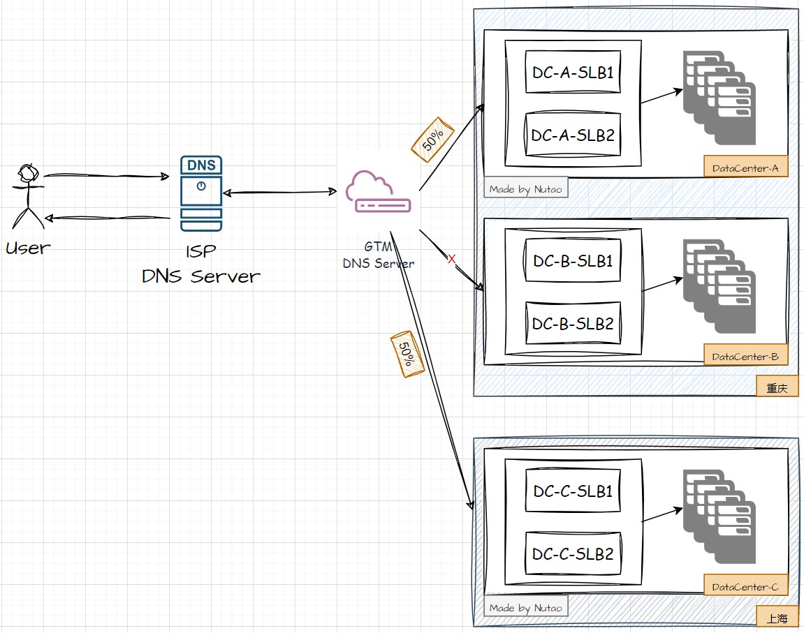
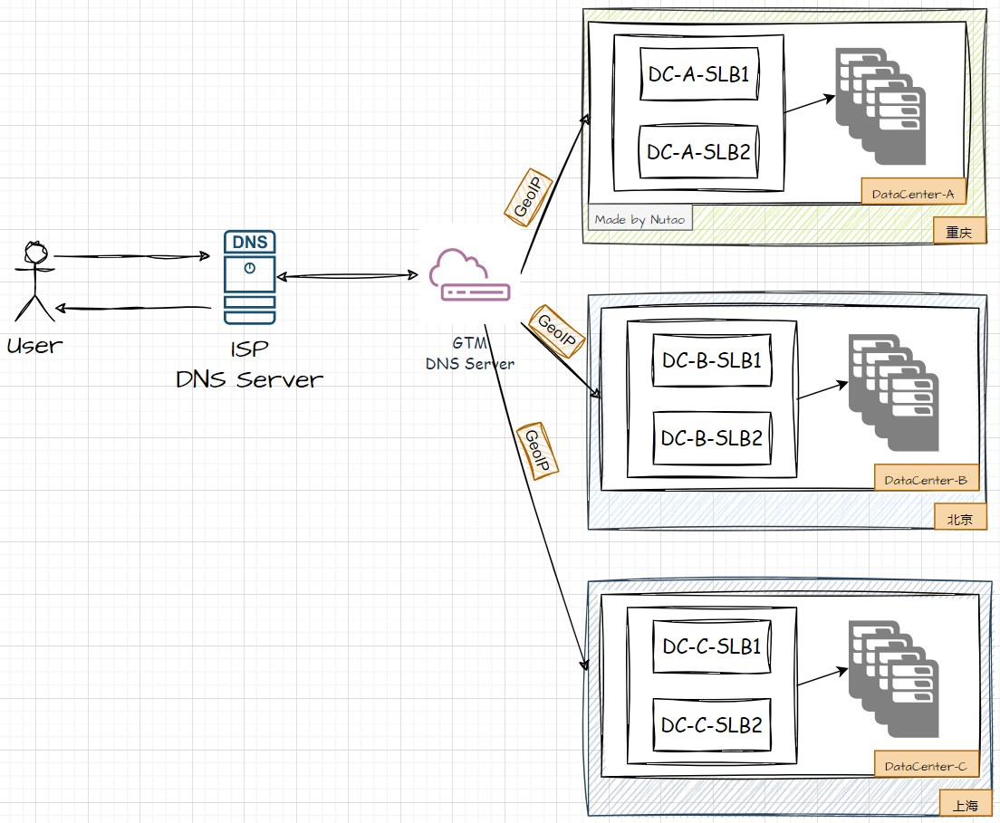

[toc]

> 本文已投稿至公众号CodeShow，欢迎关注交流容器与云原生技术
## 一、GTM简介 (Introduction)

GTM（Global Traffic Manager，全局流量管理），是一种基于DNS和分布式健康监测体系，保障应用服务高可用、高连续性的流量调度服务。基于GTM的智能DNS解析策略，企业可以实现应用服务的就近接入、高并发LoadBalancer、灵活的HealthCheck，并能够根据健康检查结果实现故障隔离和流量切换。方便企业快速构建同城多活和异地容灾服务。

<!-- more -->

Global Traffic Manager (GTM) is a traffic scheduling service based on DNS and distributed health monitoring system to ensure high availability and continuity of application services.Based on the GTM intelligent DNS resolution policy, enterprises can implement nearby access to application services, highly concurrent LoadBalancer, flexible HealthCheck, fault isolation, and traffic switchover based on health check results. It is convenient for enterprises to quickly build HA services among serveral data centers.

## 二、GTM原理 (Technical principle)

通常，访问某个网站（如a.com）时，DNS服务器会根据DNS Server的记录信息，返回准确的IP地址，然后由客户端去访问到服务实际的IP。假设a.com的域名DNS记录在企业自行维护的DNS Server上，那一个典型的DNS查询（首次）流程如下：

Usually, when you access a website (such as a.com), the DNS Server returns the exact IP address according to the recorded information of the DNS server, and then the client accesses the actual IP address of the service. Assuming that the domain name DNS of a.com is recorded on the DNS Server maintained by the enterprise itself, the typical DNS query (first time) process is as follows:



GTM属于增强的DNS服务，在配置GTM时，通常需要分配一个CNAME接入域名。企业内将实际的业务入口地址CNAME至该接入域名进行全局的负载接管，实现跨数据中心级别的容灾。增加GTM服务后，GTM会根据CNAME实际绑定的A记录和延时，返回最优的解析结果，具体流程见下图：

GTM is an enhanced DNS service. When configuring GTM, you need to assign a CNAME access domain name. The actual service entry address will be taken over by CNAME record to ensure cross-data center disaster recovery. When the GTM service is added, GTM will return the optimal result according to the actual A record and delay bound by CNAME. For details, see the following figure:



- Health Check模块：用于定期对数据中心的地址发起健康探测，在公有云中，发起探测的客户端可能来自全国多个地区，以确认线路正常可用。大多数GTM服务提供ping、tcp、http三种协议的健康探测。

  The Health Check module is used to periodically launch health checks on data center addresses. In the public cloud, the clients that launch the checks may come from multiple regions of the country to confirm that service is available. GTM services provide health detection for ping, tcp, and http.

- DNS模块：用于记录CNAME和实际的域名地址。与普通DNS不同的是，GTM中该模块同一个域名可以同时配置多个地址，以便在健康探测后可以随时摘除异常地址。同时，在负载均衡策略上，GTM设备大多支持常见的负载均衡策略，如轮询、加权轮询、源地址哈希、最小连接数等。同时也支持**基于IP位置和最小延时**等就近解析策略。

  The DNS module is used to record actual domain and CNAME. Unlike normal DNS, this module in GTM can configure multiple addresses for the same domain at the same time, so that abnormal addresses can be removed at any time after health detection. Meanwhile, in terms of load balancing strategies, GTM devices support common load balancing strategies, such as polling, weighted polling, source address hashing, and minimum number of connections. It also supports nearest resolution policies such as IP location and minimum latency.

## 三、使用场景及策略配置(Scenarios and Strategies)

基于GTM的配置，流量调度可以支持如下场景：

Based on GTM configuration, traffic scheduling can support the following scenarios:

- 基于权重的同城多活
- 同城双机房主备
- “两地三中心”异地灾备
- 跨地域智能解析


为了验证场景，我准备了如下环境：

- 两个IP地址，并且均开放了**443端口**用于TCP协议健康探测。

| IP           | 位置                  | 健康探测策略                            |
| ------------ | --------------------- | --------------------------------------- |
| xx.xx.xx.235 | （模拟）数据中心A-SLB | TCP/443，间隔15s，异常阈值：连续2次失败 |
| xx.xx.xx.199 | （模拟）数据中心B-SLB | TCP/443，间隔15s，异常阈值：连续2次失败 |

- 测试域名：test.nutao.com
- 域名CNAME地址：gtm-cn-7pp2rtgu803.nutao.com
- 测试工具：dig（支持+subnet）


在不做任何策略的情况下，域名解析结果如下：

- 默认全部返回，RR轮询

```shell
root@Nutao-PC:# dig test.nutao.com
....
;; QUESTION SECTION:
;test.nutao.com.                        IN      A

;; ANSWER SECTION:
test.nutao.com.         57      IN      CNAME   gtm-cn-7pp2rtgu803.nutao.com.
gtm-cn-7pp2rtgu803.nutao.com. 57 IN     A       xx.xx.xx.235
gtm-cn-7pp2rtgu803.nutao.com. 57 IN     A       xx.xx.xx.199
...
```


### 1. 基于权重的同城多活

在同城有两个实时同步的数据中心，每个数据中心各有两个运营商公网IP。为减轻单个机房故障带来的业务风险，可以用GTM实现基于权重的同城双活。

- 正常情况下，域名将会按照权重配置解析至A/B两机房入口。
- 异常情况下，比如A机房线路故障，则域名全部解析至B机房入口。



在同城双活的情况下，设置A-SLB和B-SLB的权重相等（均为50）。策略如下：

| 解析地址     | 权重 |
| ------------ | ---- |
| xx.xx.xx.235 | 50   |
| xx.xx.xx.199 | 50   |


验证GTM解析结果，流量均分至两个入口。

```shell
root@Nutao-PC:# dig test.nutao.com
# 多次执行时，DNS响应结果中235和199两个地址交替返回
...
;; QUESTION SECTION:
;test.nutao.com.                        IN      A

;; ANSWER SECTION:
test.nutao.com.         57      IN      CNAME   gtm-cn-7pp2rtgu803.nutao.com.
gtm-cn-7pp2rtgu803.nutao.com. 57 IN     A       xx.xx.xx.235
...

...
;; QUESTION SECTION:
;test.nutao.com.                        IN      A

;; ANSWER SECTION:
test.nutao.com.         60      IN      CNAME   gtm-cn-7pp2rtgu803.nutao.com.
gtm-cn-7pp2rtgu803.nutao.com. 60 IN     A        xx.xx.xx.199
...
```


### 2. 同城双机主备

通常，企业会将其中一个机房作为主机房，另一个作为备用机房。使用GTM时，

- 正常情况下，域名解析至A机房入口
- 当主机房A线路故障或服务宕机后，流量会自动切换至B机房（秒级切换），实现业务不中断或短暂中断。



在同城双机主备情况下，我们手动关闭235服务器的443端口，在1分钟内，GTM会发出告警信息并从地址池里剔除异常IP：


此时，通过dig验证GTM解析结果，返回信息固定为199 地址。证明流量已全部切换至DataCenter-B。

```shell
root@Nutao-PC:# dig test.nutao.com

...
;; QUESTION SECTION:
;test.nutao.com.                        IN      A

;; ANSWER SECTION:
test.nutao.com.         60      IN      CNAME   gtm-cn-7pp2rtgu803.nutao.com.
gtm-cn-7pp2rtgu803.nutao.com. 60 IN     A        xx.xx.xx.199
```


### 3. “两地三中心”异地灾备

当公司存在容灾的异地机房时，基于GTM的流量调度，可以实现：

- 正常情况下，基于权重配比，域名解析至A/B机房
- 当主机房出现异常时，GTM将基于策略自动调度部分流量至异地灾备机房，实现业务连续



验证方式与场景二类似。


### 4. 跨地域智能解析

部分大厂业务遍布全国，为方便各地区用户能就近访问服务，可以借助GTM的**GeoIP智能解析策略和最低延时**策略：

- 基于运营商的GeoIP地址库，GTM能识别出用户请求汇总携带的SubClient_IP，并返回距离最近的数据中心入口IP。
- 当最近的数据中心故障时，会根据最低延时策略，解析至延迟最低的数据中心入口IP。

> 注意：
>
> - 全链路DNS Server需要支持EDNS0
> - 全链路DNS buffsize > 512 (UDP/HTTP)



在本场景下，我们假定**数据中心位于中国境内和境外**。

- 境内用户默认就近访问数据中心A入口235
- 境外用户默认就近访问至数据中心B入口199

策略配置如下：

| 请求来源 | 解析地址                      | 备用地址（异常兜底）          |
| -------- | ----------------------------- | ----------------------------- |
| 境内     | xx.xx.xx.235（数据中心A-SLB） | xx.xx.xx.199（数据中心B-SLB） |
| 境外     | xx.xx.xx.199（数据中心B-SLB） | xx.xx.xx.235（数据中心A-SLB） |

dig工具支持EDNS0协议并携带客户端subnet信息，此时我们分别通过国内外客户端验证解析结果：

- 境内（**解析至235地址**）：

  ```shell
  root@Nutao-PC:# dig test.nutao.com  +subnet=112.80.248.0/24
  # 112.80.248.0/24 为境内C段地址
  
  ;; OPT PSEUDOSECTION:
  ; EDNS: version: 0, flags:; udp: 512
  ; CLIENT-SUBNET: 112.80.248.0/24/24
  ;; QUESTION SECTION:
  ;test.nutao.com.                        IN      A
  
  ;; ANSWER SECTION:
  test.nutao.com.         60      IN      CNAME   gtm-cn-7pp2rtgu803.nutao.com.
  gtm-cn-7pp2rtgu803.nutao.com. 60 IN     A        xx.xx.xx.235
  ```

- 境外（**解析至199地址**）：

  ```shell
  root@Nutao-PC:# dig test.nutao.com  +subnet=119.28.52.0/24
  # 119.28.52.0/24 为境外C段地址
  
  ...
  ;; OPT PSEUDOSECTION:
  ; EDNS: version: 0, flags:; udp: 512
  ; CLIENT-SUBNET: 119.28.52.0/24/24
  ;; QUESTION SECTION:
  ;test.nutao.com.                        IN      A
  
  ;; ANSWER SECTION:
  test.nutao.com.         60      IN      CNAME   gtm-cn-7pp2rtgu803.nutao.com.
  gtm-cn-7pp2rtgu803.nutao.com. 60 IN     A        xx.xx.xx.199
  ...
  ```


## 四、GTM使用限制

- GTM是DNS级别的全局负载均衡技术，由于不同运营商DNS TTL缓存设置不同，在故障发生时，实际的生效时间可能会受运营商的影响。
- 由于GTM管理的域名解析地址会根据策略发生改变，故不支持需要会话保持的服务。
- 通常来讲，数据中心内部的服务负载均衡通过LoadBalancer实现，跨数据中心的全局流量调度通过GTM实现。


>
> 一起探讨更多的技术细节，欢迎关注公众号CodeShow
> 