MongoDB OPS Manager 是用于管理MongoDB集群和部署的工具。 通过MMS可以大大简化MongDB的管理部署。

<!-- more -->

## 1. 机器

**三台机器 (注意修改hosts)**
- master
- node1
- node2

## 2. 安装前准备[ALL]

#### NUMA Settings

```bash
sysctl -w vm.zone_reclaim_mode=0
```

#### NTP Settings

```bash
sudo apt install -y ntp
service ntp start
```

#### ulimt settings

```bash
> ulimit  -a
> sudo vi /etc/security/limits.conf
```

追加

```yaml
mongod soft nproc 65535
mongod hard nproc 65535
```

#### Disable Transparent Huge Pages

```bash
vim /etc/init.d/disable-transparent-hugepages
```

添加如下脚本

```bash
#!/bin/bash
### BEGIN INIT INFO
# Provides:          disable-transparent-hugepages
# Required-Start:    $local_fs
# Required-Stop:
# X-Start-Before:    mongod mongodb-mms-automation-agent
# Default-Start:     2 3 4 5
# Default-Stop:      0 1 6
# Short-Description: Disable Linux transparent huge pages
# Description:       Disable Linux transparent huge pages, to improve
#                    database performance.
### END INIT INFO
case $1 in
  start)
    if [ -d /sys/kernel/mm/transparent_hugepage ]; then
      thp_path=/sys/kernel/mm/transparent_hugepage
    elif [ -d /sys/kernel/mm/redhat_transparent_hugepage ]; then
      thp_path=/sys/kernel/mm/redhat_transparent_hugepage
    else
      return 0
    fi
    echo 'never' > ${thp_path}/enabled
    echo 'never' > ${thp_path}/defrag

    unset thp_path
    ;;
esac
```

验证(重启生效)

```bash
cat /sys/kernel/mm/transparent_hugepage/enabled
cat /sys/kernel/mm/transparent_hugepage/defrag
```

有以下输出表示正确

```bash
always madvise [never]
```

## 3. 安装MongoDB(每台机器上)

[**我的笔记-NoSQL-MongoDB单机部署**](https://www.evernote.com/shard/s665/sh/68b601b3-9fea-46df-9438-8de0f3f83580/50cb5a61f1fa144e79dc93191fdf9ddd)

[**使用TUNA源安装MongoDB**](https://mirrors.tuna.tsinghua.edu.cn/help/mongodb/)

#### 配置ReplicatSet副本

ReplicatSet结构如下
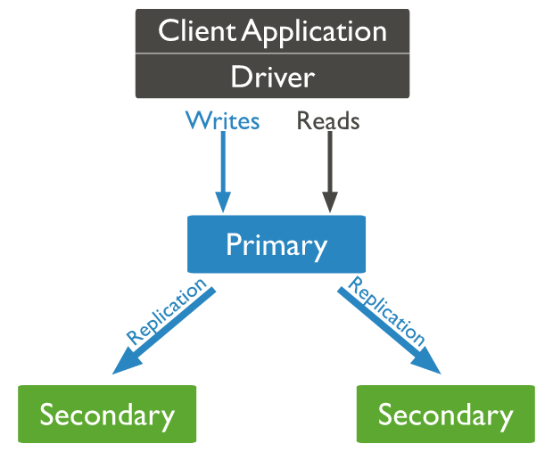

Primary Node将自己的数据同步到Secondary Node
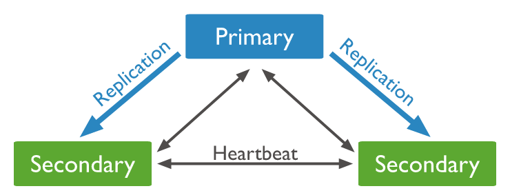

一旦primary Node挂了，或者10s内无法取得Heartbeat，Secondary Node会选举新的Primary Node

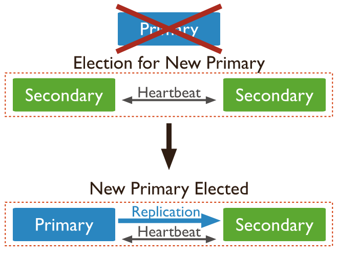

#### [ALL]修改配置文件(最好自建)

```bash
# 默认mongodb.conf在 /etc/mongodb.conf
vim  /home/cisdi/DBTEST/mongodb/mongod.conf
```

```yaml
# for documentation of all options, see:
#   http://docs.mongodb.org/manual/reference/configuration-options/

# Where and how to store data.
storage:
  dbPath: /home/cisdi/DBTEST/mongodb/data
  journal:
    enabled: true
#  engine:
#  mmapv1:
#  wiredTiger:

# where to write logging data.
systemLog:
  destination: file
  logAppend: true
  path: /home/cisdi/DBTEST/mongodb/log/mongodb.log

# network interfaces
net:
  port: 27018
 # bindIp: 127.0.0.1

processManagement:
  fork: true
#security:
#operationProfiling:

# 副本
replication:
  replSetName: ops_manager
#sharding:
## Enterprise-Only Options:
#auditLog:
#snmp:
```
[**`ALL`**]启动MongoDB

```bash
mongod -f /home/cisdi/DBTEST/mongodb/mongod.conf
```

> 配置方式

在**任意一台**机器上登录mongo

```bash
# 我们选master
mongo --port 27018
```

```bash
#Initiate the replica set
rs.initiate()
#display the replica set configuration object
rs.conf()
#Add the remaining members to the replica set
rs.add("node1:27018")
rs.add("node2:27018")
#Check the status of the replica set
rs.status()
```

Mongo打印如下的JSON表示副本集配置成功 (注意所有的节点都要health:1)

```bash
{
	"set" : "ops_manager",
	"date" : ISODate("2017-06-27T07:37:35.839Z"),
	"myState" : 2,
	"term" : NumberLong(4),
	"syncingTo" : "node1:27018",
	"heartbeatIntervalMillis" : NumberLong(2000),
	"members" : [
		{
			"_id" : 0,
			"name" : "master:27018",
			"health" : 1,
			"state" : 2,
			"stateStr" : "SECONDARY",
			"uptime" : 771,
			"optime" : {
				"ts" : Timestamp(1498549030, 2),
				"t" : NumberLong(4)
			},
			"optimeDate" : ISODate("2017-06-27T07:37:10Z"),
			"syncingTo" : "node1:27018",
			"configVersion" : 3,
			"self" : true
		},
		{
			"_id" : 1,
			"name" : "node1:27018",
			"health" : 1,
			"state" : 1,
			"stateStr" : "PRIMARY",
			"uptime" : 625,
			"optime" : {
				"ts" : Timestamp(1498549030, 2),
				"t" : NumberLong(4)
			},
			"optimeDate" : ISODate("2017-06-27T07:37:10Z"),
			"lastHeartbeat" : ISODate("2017-06-27T07:37:34.995Z"),
			"lastHeartbeatRecv" : ISODate("2017-06-27T07:37:35.647Z"),
			"pingMs" : NumberLong(0),
			"electionTime" : Timestamp(1498548441, 1),
			"electionDate" : ISODate("2017-06-27T07:27:21Z"),
			"configVersion" : 3
		},
		{
			"_id" : 2,
			"name" : "node2:27018",
			"health" : 1,
			"state" : 2,
			"stateStr" : "SECONDARY",
			"uptime" : 595,
			"optime" : {
				"ts" : Timestamp(1498549030, 2),
				"t" : NumberLong(4)
			},
			"optimeDate" : ISODate("2017-06-27T07:37:10Z"),
			"lastHeartbeat" : ISODate("2017-06-27T07:37:34.994Z"),
			"lastHeartbeatRecv" : ISODate("2017-06-27T07:37:35.780Z"),
			"pingMs" : NumberLong(0),
			"syncingTo" : "node1:27018",
			"configVersion" : 3
		}
	],
	"ok" : 1
}
```

## 4. 安装OPS Manager[ONE]

> Notice

- **`最好是root安装,否则各种权限问题`**
- 建议用tgz包, 更容易管理
- [下载OPS Manager](https://www.mongodb.com/download-center#ops-manager)


#### 修改OPS Manager 配置文件

```bash
vi /root/mongodb-mms-3.4.5.424-1.x86_64/conf/conf-mms.properties
```

修改  <kbd>**mongo.mongoUri**</kbd>

```bash
mongo.mongoUri=mongodb://master:27018,node1:27018,node2:27018
```

#### 启动 MMS

```bash
./root/mongodb-mms-3.4.5.424-1.x86_64/bin/mongodb-mms start

Starting pre-flight checks
Successfully finished pre-flight checks

Migrate Ops Manager data
   Running migrations...[  OK  ]
Start Ops Manager server
   Instance 0 starting...................[  OK  ]
Starting pre-flight checks
Successfully finished pre-flight checks

Start Backup Daemon...[  OK  ]
```

MMS 网页: http://yourip:8080

**需要先注册一个Admin用户**

#### 配置MongoDB集群

> Cluster架构设计

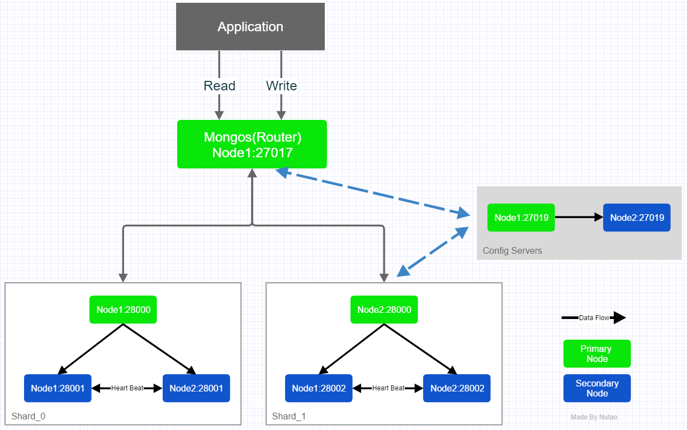

> 下载相关版本的 MongoDB

为了加快集群的部署, 可以预先下载好所需的MongoDB安装包，并将其放置到目录
<kbd>**`/var/lib/mongodb-mms-automation/mongodb-linux-x86_64-x.x.x`**</kbd>
例如：

```bash
# 解压
tar -zxvf mongodb-linux-x86_64-ubuntu1604-3.4.2.tgz -C /var/lib/mongodb-mms-automation/mongodb-linux-x86_64-3.4.2
# 设置权限(最好是先　ｌs -l　查一下用户权限)
sudo chown -R mongodb: /var/lib/mongodb-mms-automation/mongodb-linux-x86_64-3.4.2/
```

> 新建Cluster

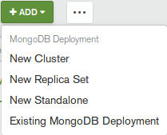

> 安装Ops Manager Agent (每一个子节点都要安装)

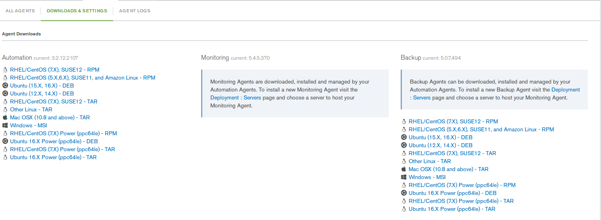

选择一个适当的版本下载, 然后根据教程修改相关的参数

> 配置Cluster

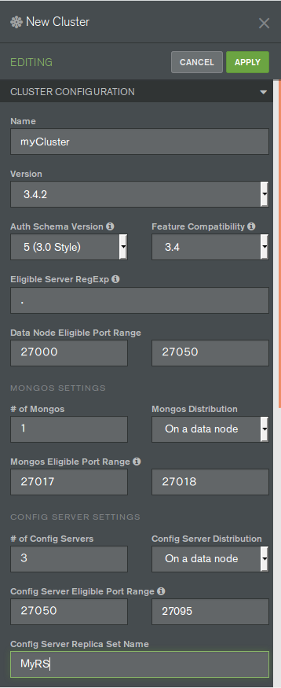
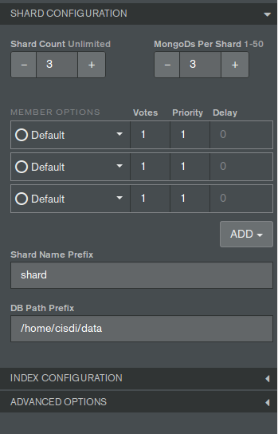

**`注意`**：
- 选择的Version版本是自己放到　*/var/lib/mongodb-mms-automation* 的版本

> **配置完后点击apply，等待所有部署完成**

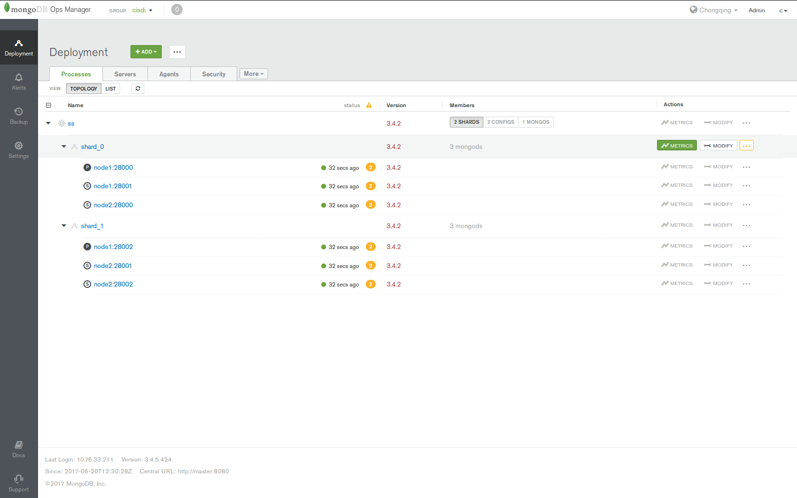
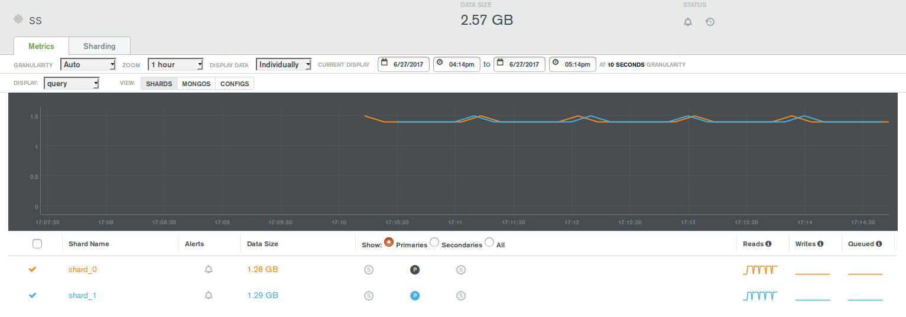


## 5. 通过Mongos连接到集群
> 检查Mongos部署的位置和端口

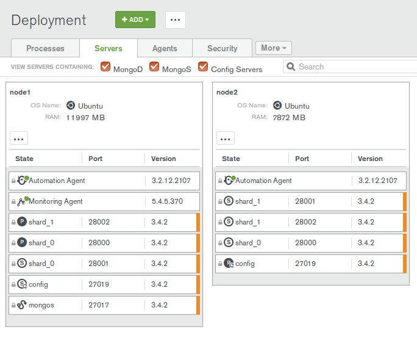
> 连接命令

```bash
mongo --host node1 --port 27017
```

```bash
MongoDB shell version: 3.2.14
connecting to: node1:27017/test
Welcome to the MongoDB shell.
# 获取集群分片信息
mongos> db.getCollection('test').getShardDistribution()

Shard shard_0 at shard_0/node1:28000,node1:28001,node2:28000
 data : 1.28GiB docs : 370161 chunks : 34
 estimated data per chunk : 38.59MiB
 estimated docs per chunk : 10887

Shard shard_1 at shard_1/node1:28002,node2:28001,node2:28002
 data : 1.29GiB docs : 372693 chunks : 34
 estimated data per chunk : 38.85MiB
 estimated docs per chunk : 10961

Totals
 data : 2.57GiB docs : 742854 chunks : 68
 Shard shard_0 contains 49.83% data, 49.82% docs in cluster, avg obj size on shard : 3KiB
 Shard shard_1 contains 50.16% data, 50.17% docs in cluster, avg obj size on shard : 3KiB
```

## 6. 可能遇到的Bug
> Q1. MMS无法启动或者在MMS执行操作时，总是提示Another Session has published the deploy

可能原因：
- 管理MMS数据的 MongoDB ReplicatSet Primary Node挂了，而两个Secondary Node在选举的时候出现“间歇性切换”（由于Primary的数据没有Sync到所有的Secondary Node导致的从节点的数据不一致）。从而使导致MMS的Log和启动数据无法加载。

**`解决方法：`**
由于启动挂掉的Mongod节点需要做长时间的Rollback， 如果没有办法成功Rollback，直接舍弃掉挂掉的Node的数据（**全部删除**）, 然后将其设置为Arbiter Node（仲裁节点，不参与数据存储，仅仅做选举投票使用）。

调整后的MongoDB ReplicateSet结构如下
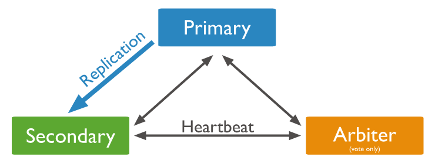

```
> rs.status()
{
    "set" : "ops_manager",
    "date" : ISODate("2017-06-29T13:10:51.081Z"),
    "myState" : 1,
    "term" : NumberLong(3110),
    "heartbeatIntervalMillis" : NumberLong(2000),
    "members" : [
        {
            "_id" : 0,
            "name" : "master:27018",
            "health" : 1.0,
            "state" : 1,
            "stateStr" : "PRIMARY",
            "uptime" : 87435,
            "optime" : {
                "ts" : Timestamp(6437047226601570, 4),
                "t" : NumberLong(3110)
            },
            "optimeDate" : ISODate("2017-06-29T13:10:49.000Z"),
            "electionTime" : Timestamp(6436975792705503, 1),
            "electionDate" : ISODate("2017-06-29T08:33:37.000Z"),
            "configVersion" : 5,
            "self" : true
        },
        {
            "_id" : 2,
            "name" : "node2:27018",
            "health" : 1.0,
            "state" : 2,
            "stateStr" : "SECONDARY",
            "uptime" : 16637,
            "optime" : {
                "ts" : Timestamp(6437047226601570, 4),
                "t" : NumberLong(3110)
            },
            "optimeDate" : ISODate("2017-06-29T13:10:49.000Z"),
            "lastHeartbeat" : ISODate("2017-06-29T13:10:50.968Z"),
            "lastHeartbeatRecv" : ISODate("2017-06-29T13:10:49.752Z"),
            "pingMs" : NumberLong(0),
            "syncingTo" : "master:27018",
            "configVersion" : 5
        },
        {
            "_id" : 3,
            "name" : "node1:27018",
            "health" : 1.0,
            "state" : 7,
            "stateStr" : "ARBITER",
            "uptime" : 16233,
            "lastHeartbeat" : ISODate("2017-06-29T13:10:50.305Z"),
            "lastHeartbeatRecv" : ISODate("2017-06-29T13:10:50.843Z"),
            "pingMs" : NumberLong(0),
            "syncingTo" : "node2:27018",
            "configVersion" : 5
        }
    ],
    "ok" : 1.0
}
```

## 7. 参考文献
> 参考文档

https://docs.opsmanager.mongodb.com/current/core/installation-checklist/
https://docs.opsmanager.mongodb.com/current/core/requirements/#onprem-system-requirements
https://docs.mongodb.com/manual/administration/production-notes/

> 参考博客

http://www.cnblogs.com/wsl222000/p/6742504.html
