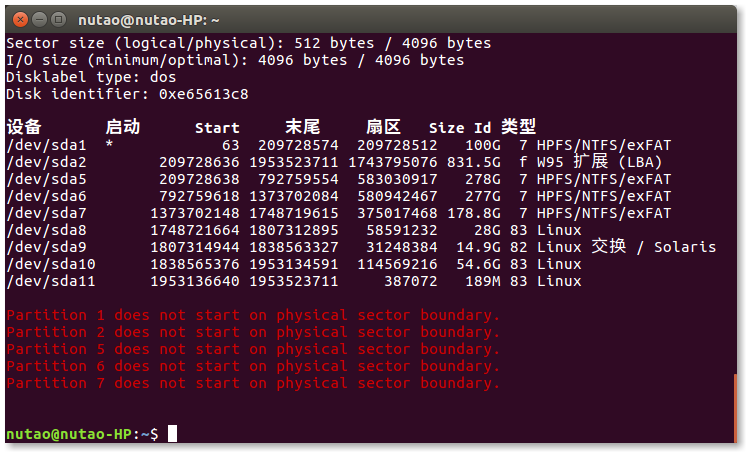
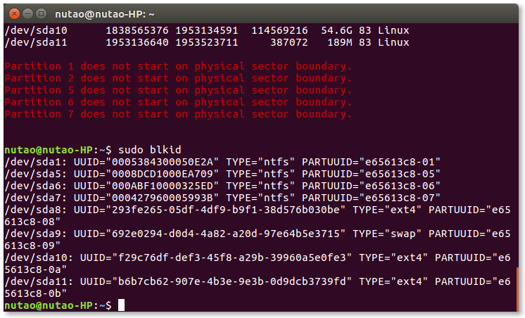

这次写的教程是经过我多次验证，用于对Ubuntu分区（目录）操作的一些经验。分享给大家，希望能够有所帮助。

**友善提醒：硬盘操作有风险，请注意备份自己的重要资料。如果不熟练，请在虚拟机上自己多操作几次，再在Server上面操作**

<!-- more -->

## 1.为啥会被分区容量所困扰？

通常情况下，我们在使用Ubuntu还是没啥大毛病。可是有一天，突然在解开锁屏的时候，突然弹出如下警告。。。


系统磁盘容量不足！！！这个时候就有点烦心了。左思右想，有如下几种应急方法（欢迎添加）

- 先去删一波 /tmp, /var/cache/apt/archives下面的临时文件， 删掉不用的软件和遗留的目录、日志
- autoremove, autoclean 删掉多余的 lib
- 删掉/home下面多余的文档
- 添加新的硬盘
前三种方法都是暂时性的应急，不是长久之计。而且，当你的硬盘里面存了大量的重要的资料的时候（譬如用户的数据，重要的数据文件等），这个时候就不得不采用第四种方案了。

## 解决方案

> 将新的硬盘挂载到需要添加存储介质的目录下（根据实际需要）

## 1. 查看磁盘信息
```bash
sudo fdisk -l
```


作为测试，我选取 /dev/sda5, 想要将其挂载到 /home/nutao/disk/D 下面

查看硬盘使用情况用如下命令：
```bash
df -kh
```
## 2. 查看硬盘 UUID 和 磁盘类型
```bash
sudo blkid
```


用记事本或者其他工具记录下 /dev/sda5 的UUID和分区格式（建议将新的硬盘分区为ext4）

## 3. 取消挂载目标盘
```bash
sudo umount /dev/sda5
```
## 4. 编辑 /etc/fstab 文件
```bash
sudo vi /etc/fstab
```
追加一行内容
```bash
UUID=0008DCD1000EA709 /home/nutao/disk/D    ntfs    defaults    0   2
```
其中第一列为UUID, 第二列为挂载目录（该目录必须为空目录），第三列为文件系统类型，第四列为参数，第五列0表示不备份，最后一列必须为２或0(除非引导分区为1)

## 5. 更新引导（千万记得更新，否则重启会出错）
```bash
sudo update-grub
sudo update-grub2
```
---

## Linux下分区工具 gparted
安装命令
```bash
# Debian
sudo apt-get install gparted

# Fedora
su -c "yum install gparted"

# OpenSUSE
sudo zypper install gparted

# Ubuntu
sudo apt-get install gparted
```
