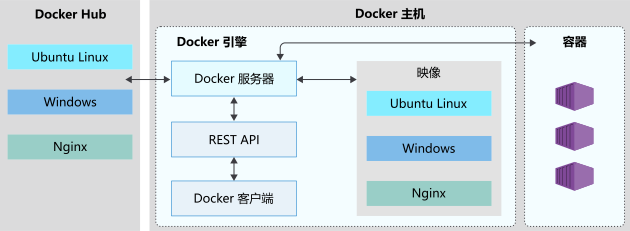

 
Docker 是一个用于开发、交付和运行容器的容器化平台。它利用容器技术，将应用程序及其依赖的库、框架、工具等封装在一个虚拟化的容器中，使得应用程序可以在任意环境中运行，并能够快速地进行部署、扩展和管理。利用容器技术，将应用程序及其依赖的库、框架、工具等封装在一个虚拟化的容器中，使得应用程序可以在任意环境中运行，并能够快速地进行部署、扩展和管理。*声明：上述介绍由chatGPT生成*

*From: [microsoft-learn](https://learn.microsoft.com/zh-cn/training/modules/intro-to-docker-containers/media/2-docker-architecture.svg)*

<!-- more -->