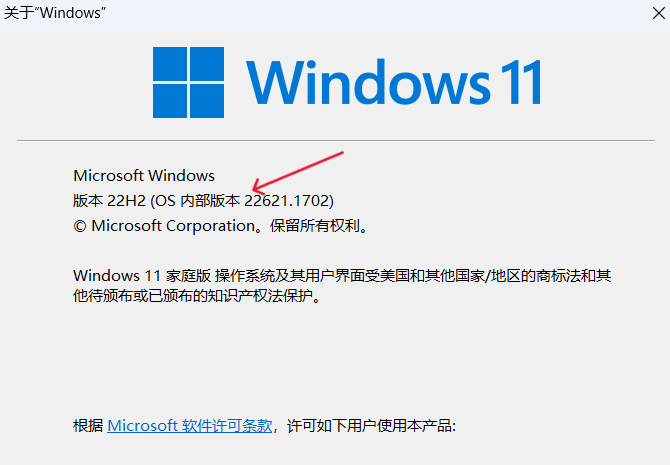

WSL 2 是适用于 Linux 的 Windows 子系统体系结构的一个新版本，它支持适用于 Linux 的 Windows 子系统在 Windows 上运行 ELF64 Linux 二进制文件。相比于WSL1，WSL2 使用的是全新的体系结构，能够通过子系统方式运行**真正的 Linux内核**。

<!-- more  -->

## 一、WSL1 与 WSL2 对比

WSL2在**托管 VM** 内使用实际的 Linux 内核，在牺牲部分跨OS文件系统性能（子系统和windows之间进行文件写入、复制或修改）的情况下，支持完整的系统调用兼容性以及跨 Linux 和 Windows 操作系统的性能。以下为两个版本的WSL功能对比：

| 功能                                           | WSL 1 | WSL 2 |
| :--------------------------------------------- | :---- | :---- |
| Windows 和 Linux 之间的集成                    | ✅     | ✅     |
| 启动时间短                                     | ✅     | ✅     |
| 与传统虚拟机相比，占用的资源量少               | ✅     | ✅     |
| 可以与当前版本的 VMware 和 VirtualBox 一起运行 | ✅     | ✅     |
| 托管 VM                                        | ❌     | ✅     |
| 完整的 Linux 内核                              | ❌     | ✅     |
| 完全的系统调用兼容性                           | ❌     | ✅     |
| 跨 OS 文件系统的性能                           | ✅     | ❌     |

内容源引：[比较 WSL 版本 | Microsoft Learn](https://learn.microsoft.com/zh-cn/windows/wsl/compare-versions)

总的来讲，WSL2使用完整的Linux Kernel，且有更好的兼容性和系统互操作性。


## 二、Windows系统要求

> 注意：WSL 2 仅在 Windows 11 或 Windows 10 版本 1903、内部版本 18362 或更高版本中可用。
>
> > 如果需要在低版本win10中安装wsl2，请参考 [旧版 WSL 的手动安装步骤 | Microsoft Learn](https://learn.microsoft.com/zh-cn/windows/wsl/install-manual)

安装前，需要检查windows版本。。。按windows建，输入 `winver` ..



## 三、安装WSL2及Linux

使用**管理员模式**打开Powershell或者CMD，

- 查看wsl发行版

```powershell
PS C:\Users\admin> wsl --list --online

NAME                                   FRIENDLY NAME
Ubuntu                                 Ubuntu
Debian                                 Debian GNU/Linux
kali-linux                             Kali Linux Rolling
Ubuntu-18.04                           Ubuntu 18.04 LTS
Ubuntu-20.04                           Ubuntu 20.04 LTS
Ubuntu-22.04                           Ubuntu 22.04 LTS
OracleLinux_7_9                        Oracle Linux 7.9
OracleLinux_8_7                        Oracle Linux 8.7
OracleLinux_9_1                        Oracle Linux 9.1
SUSE-Linux-Enterprise-Server-15-SP4    SUSE Linux Enterprise Server 15 SP4
openSUSE-Leap-15.4                     openSUSE Leap 15.4
openSUSE-Tumbleweed                    openSUSE Tumbleweed
```

- 安装制定发行版。比如Ubuntu

```powershell
wsl --install -d Ubuntu
```

等待安装完毕后，设置账密即可

- 查看已安装的Linux子系统

```powershell
wsl --list -v

  NAME                   STATE           VERSION
* docker-desktop         Stopped         2
  docker-desktop-data    Stopped         2
  Ubuntu-22.04           Running         2
```


## 四、使用WSL2的一些骚操作

### 1、使用GPU跑ML任务

### 2、使用VSCode实现Win开发，WSL部署

### 3、开启WSL子系统图形界面

### 4、在windows上安装并使用真正意义上的Docker
