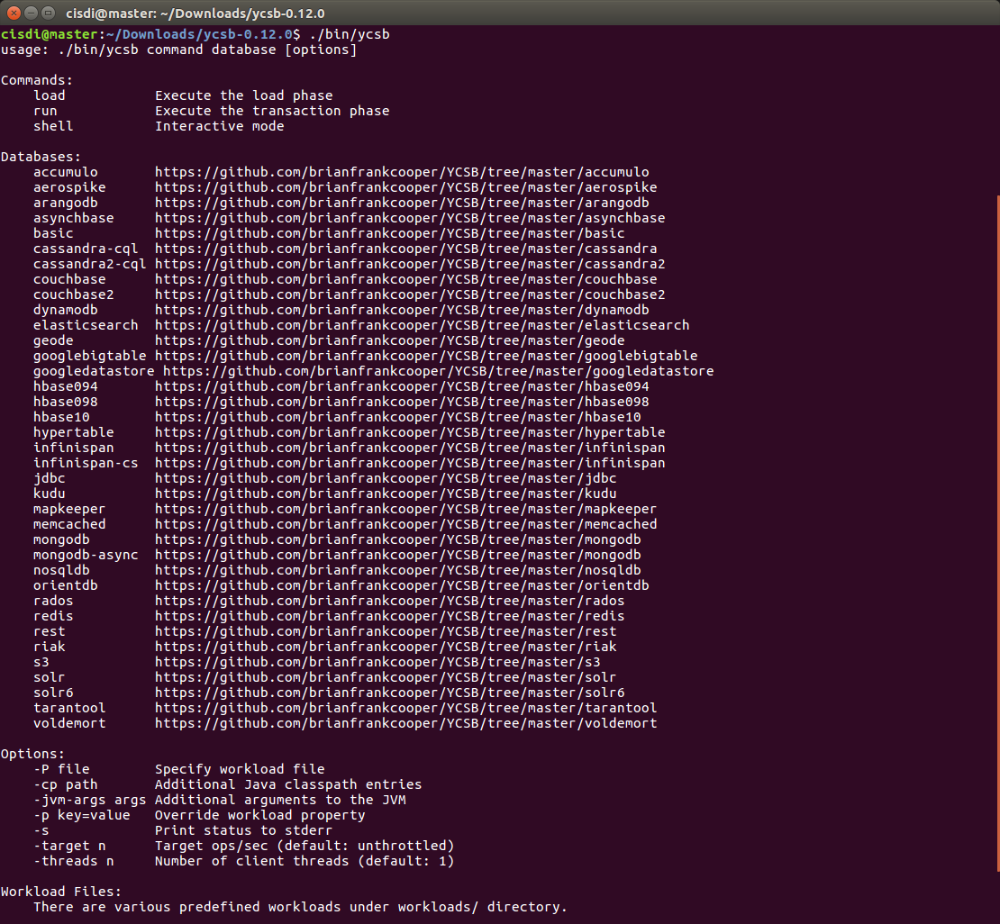

## 简单介绍
YCSB, 英文全称：Yahoo! Cloud Serving Benchmark (YCSB) 。是 Yahoo 公司的一个用来对云服务进行基础测试的工具, 目标是促进新一代云数据服务系统的性能比较。由于它集成了大多数常用的数据库的测试代码，所以，它也是数据库测试的一大利器.

<!-- more -->

项目Github地址: [YCSB](https://github.com/brianfrankcooper/YCSB)

文中部分资料翻译自：https://github.com/brianfrankcooper/YCSB/wiki
## 配置YCSB环境
> Java

- 到 [Oracle](http://www.oracle.com/technetwork/java/javase/downloads/index.html) 下载相应的Java版本 
- 或者直接用 apt-get 下载, 教程[Nutao-Ubuntu 安装java](https://www.evernote.com/shard/s665/sh/e9471479-2b1e-4da2-811c-52cfd529b988/e02b25b3d16554b0f83cd8270b5f1fa7)
- 验证JAVA是否安装成功 **java -version**:

```
$ java -version

java version "1.8.0_131"
Java(TM) SE Runtime Environment (build 1.8.0_131-b11)
Java HotSpot(TM) 64-Bit Server VM (build 25.131-b11, mixed mode)
```
> Maven

- 到国内开源镜像下载Maven, 推荐使用[TUNA-清华开源镜像站](https://mirrors.tuna.tsinghua.edu.cn/apache/maven/maven-3/)
- 配置Maven

```bash
# 解压
tar -zxvf apache-maven-3.5.0-bin.tar.gz -C /usr/local
# 配置MAVEN_HOME
sudo vi /etc/profile
```
- 追加

```bash
#Maven_home
export MAVEN_HOME=/home/cisdi/software/apache-maven-3.5.0
export PATH=${MAVEN_HOME}/bin:$PATH
```

- 然后 Source

```bash
source /etc/profile
```
- 注销或重启后生效( 不重启在当前Shell 下生效)

```bash
# 验证
$ mvn -version

Apache Maven 3.5.0 (ff8f5e7444045639af65f6095c62210b5713f426; 2017-04-04T03:39:06+08:00)
Maven home: /home/cisdi/software/apache-maven-3.5.0
Java version: 1.8.0_131, vendor: Oracle Corporation
Java home: /usr/lib/jvm/java-8-oracle/jre
Default locale: en_US, platform encoding: UTF-8
OS name: "linux", version: "4.4.0-83-generic", arch: "amd64", family: "unix"
```
### 下载YCSB
> 目前最新的稳定版本是 [0.12.0](https://github.com/brianfrankcooper/YCSB/releases/tag/0.12.0) （下载特别慢, 最好是挂VPN或者用云服务器下载）
```bash
curl -O --location https://github.com/brianfrankcooper/YCSB/releases/download/0.12.0/ycsb-0.12.0.tar.gz
tar xfvz ycsb-0.12.0.tar.gz
cd ycsb-0.12.0
```
> 或者直接在Github上克隆 (编译巨慢, 要下很多的包)
```bash
git clone git://github.com/brianfrankcooper/YCSB.git
cd YCSB

# 全量编译
mvn clean package
# 部分编译, 以MongoDB为例
mvn -pl com.yahoo.ycsb:mongodb-binding -am clean package
```
编译的命令参考其项目Readme.每一个组件都可以单独编译，相当良心。

测试是否安装成功

```
./bin/ycsb
```

## 测试
### 编写Workload（这部分英文比较简单，将就看看吧）
[资料来源](https://github.com/brianfrankcooper/YCSB/wiki/Core-Properties)
> Core YCSB properties

- **workload**: workload class to use (e.g. com.yahoo.ycsb.workloads.CoreWorkload)
- **db**: database class to use. Alternatively this may be specified on the command line. (default: com.yahoo.ycsb.BasicDB)
- **exporter**: measurements exporter class to use (default: com.yahoo.ycsb.measurements.exporter.TextMeasurementsExporter)
- **exportfile**: path to a file where output should be written instead of to stdout (default: undefined/write to stdout)
- **threadcount**: number of YCSB client threads. Alternatively this may be specified on the command line. (default: 1)
- **measurementtype**: supported measurement types are histogram and timeseries (default: histogram)

> Core workload package properties

- **fieldcount**: the number of fields in a record (default: 10)
- **fieldlength**: the size of each field (default: 100)
- **readallfields**: should reads read all fields (true) or just one (false) (default: true)
- **readproportion**: what proportion of operations should be reads (default: 0.95)
- **updateproportion**: what proportion of operations should be updates (default: 0.05)
- **insertproportion**: what proportion of operations should be inserts (default: 0)
- **scanproportion**: what proportion of operations should be scans (default: 0)
- **readmodifywriteproportion**: what proportion of operations should be read a record, modify it, write it back (default: 0)
- **requestdistribution**: what distribution should be used to select the records to operate on – uniform, zipfian or latest (default: uniform)
- **maxscanlength**: for scans, what is the maximum number of records to scan (default: 1000)
- **scanlengthdistribution**: for scans, what distribution should be used to choose the number of records to scan, for each scan, between 1 and maxscanlength (default: uniform)
- **insertorder**: should records be inserted in order by key (“ordered”), or in hashed order (“hashed”) (default: hashed)
- **operationcount**: number of operations to perform.
- **maxexecutiontime**: maximum execution time in seconds. The benchmark runs until either the operation count has exhausted or the maximum specified time has elapsed, whichever is earlier.
- **table**: the name of the table (default: usertable)
- **recordcount**: number of records to load into the database initially (default: 0)
- **core_workload_insertion_retry_limit**: number of attempts for any failed insert operation (default: 0)
- **core_workload_insertion_retry_interval**: interval between retries, in seconds (default: 3)
 
> MongoDB的 workload模板

[mongodb参数设置](https://github.com/brianfrankcooper/YCSB/tree/master/mongodb)
```python
# 记录数
recordcount = 1000000
# 操作次数
operationcount = 10000000
# 使用的workload class
workload=com.yahoo.ycsb.workloads.CoreWorkload
# 读取所有的字段
readallfields=true
# 读操作的占比
readproportion=0.1
# 更新操作占比
updateproportion=0.9
# 插入操作的占比
insertproportion=0
# 请求分布方式
requestdistribution=zipfian
# 插入顺序
insertorder=ordered
# 字段长度
fieldlength=8
# 单元格个数
fieldcount=20
# 表名
table = test
# 线程数(这里最好不要指定, 在执行的时候用 -threads 指定)
# threadcount=32

# mongodb的url
mongodb.url=mongodb://10.66.3.31:28001
# MongoDB的写安全设置
mongodb.writeConcern = acknowledged
# 批量写入的数据条数
mongodb.batchsize = 1000
# 最大连接数
mongodb.maxconnections = 1000
```

### 执行测试
[执行参数](https://github.com/brianfrankcooper/YCSB/wiki/Running-a-Workload)

```
# 可以通过此命令查看ｙｃｓｂ的参数
./bin/ycsb
```

>shell命令

```ｂａｓｈ
./bin/ycsb load mongodb-async -s -threads 20 -P workloads/mongodb/b > out
```
- -s 代表输出status
- -threads 指定线程数
- -P 指定workload
-  \> 代表stdout 输出到 out 文件

> 测试结果输出

```bash
cisdi@master:~/Downloads/ycsb-0.12.0$ cat out 

mongo connection created with mongodb://10.66.3.31:28001
[OVERALL], RunTime(ms), 9759.0
[OVERALL], Throughput(ops/sec), 102469.51531919253
[TOTAL_GCS_PS_Scavenge], Count, 33.0
[TOTAL_GC_TIME_PS_Scavenge], Time(ms), 849.0
[TOTAL_GC_TIME_%_PS_Scavenge], Time(%), 8.699661850599446
[TOTAL_GCS_PS_MarkSweep], Count, 2.0
[TOTAL_GC_TIME_PS_MarkSweep], Time(ms), 166.0
[TOTAL_GC_TIME_%_PS_MarkSweep], Time(%), 1.700993954298596
[TOTAL_GCs], Count, 35.0
[TOTAL_GC_TIME], Time(ms), 1015.0
[TOTAL_GC_TIME_%], Time(%), 10.400655804898044
[CLEANUP], Operations, 20.0
[CLEANUP], AverageLatency(us), 59.35
[CLEANUP], MinLatency(us), 3.0
[CLEANUP], MaxLatency(us), 1051.0
[CLEANUP], 95thPercentileLatency(us), 15.0
[CLEANUP], 99thPercentileLatency(us), 1051.0
[INSERT], Operations, 1000000.0
[INSERT], AverageLatency(us), 180.985195
[INSERT], MinLatency(us), 1.0
[INSERT], MaxLatency(us), 1302527.0
[INSERT], 95thPercentileLatency(us), 6.0
[INSERT], 99thPercentileLatency(us), 13.0
[INSERT], Return=OK, 1000
[INSERT], Return=BATCHED_OK, 999000
```

